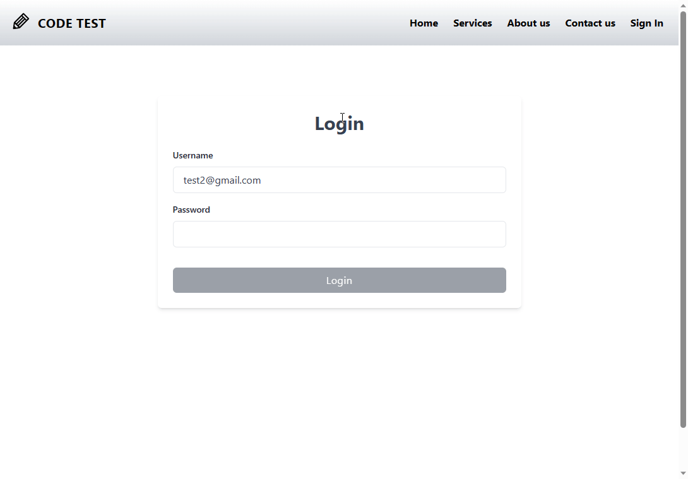

## Overview
This is a project with latest Nextjs app router and serverless api. It is a simple website that allows user to login and register.

Only login functionality is implemented with UI, the register functionality is implemented with API.

Login API generates the JWT token upon login.The JWT token is encrypted with a secret key and the token is valid for 30 days. The JWT token is required for calling the get user endpoint.

Project is using MongoDB as the database. The database can be hosted on MongoDB Atlas, but it can be run locally as well using docker compose.

Implemented with a databse based user locking machanism. If a user tries to login with wrong password 3 times, the user will be locked for maximum 5 minutes.

## Tech Stack
1. Framework: NextJs, Typescript, TailwindCSS
1. Database: MongoDB, Prisma
1. Build & Release: Docker, Docker Compose
1. Testing: Jest, React Testing Library
1. Coding Standard: ESLint, Husky, Lint Staged, Commitlint

## Configuration
At .env file <br>
```DATABASE_URL``` : Mongodb connection URL <br>
```SECRET_KEY``` : A long string to encrypt/decrypt the JWT token

## Getting Started
First, run the development server:

```bash
npm run dev
# or
yarn dev
# or
pnpm dev
```

Open [http://localhost:3000](http://localhost:3000) with your browser to see the result.

Here is a gif shows how the website works<br>


## Run with Docker
```bash
# Build the database and app images
docker-compose up -d

# Go to the app container terminal to generate the prisma client
npx prisma db push

# Make an API call to register a user
curl --location 'http://localhost:3000/api/user' \
--header 'Content-Type: application/json' \
--data-raw '{
    "firstname": "Jodie",
    "lastname": "Lu",
    "email": "test@gmail.com",
    "password": "1234"
}'

# Go to the db container terminal to inspect the newly created user
mongosh
use codetest
db.Users.find()

# Navigate to http://localhost:3000/login to login with the registered user

# cleanup the docker resource after finish testing
docker compose down -v --rmi all --remove-orphans
```

## To DOs
1. Integration Test is not working properly, need to fix
1. Implement logging machanism
1. Implement a better error handling machanism
1. Implement API middleware to validate the JWT token for all the protected endpoints
1. Implement API middleware to handle the rate limiting to stop brute force attack
1. Deploy to cloud using Google/Azure/Vercel
